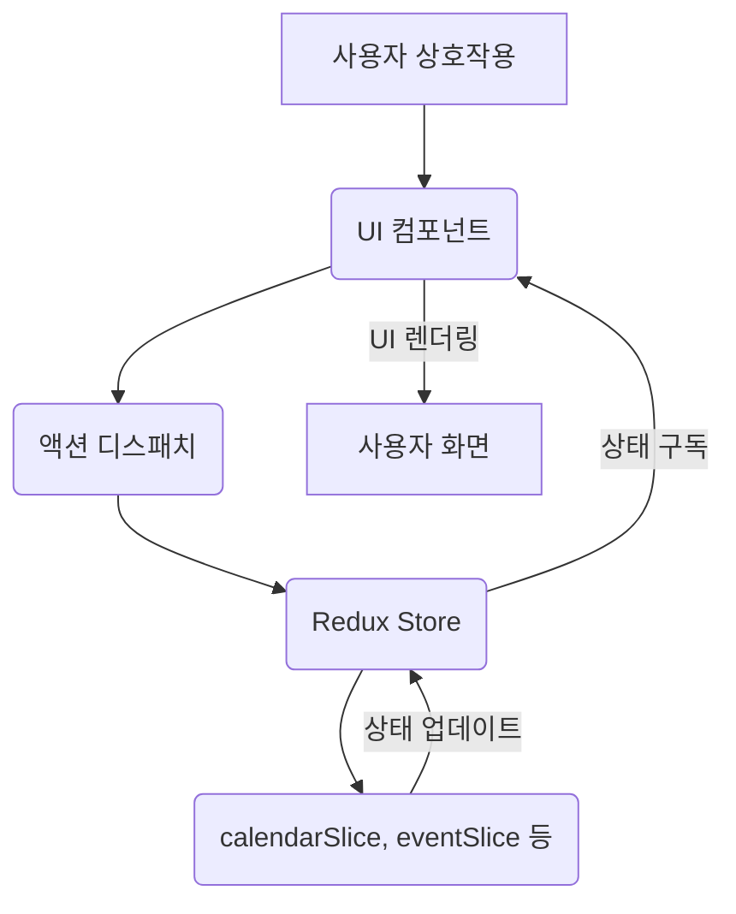

# Google Calendar Clone Project

[Google Calendar](https://calendar.google.com/calendar) 주간별/월간별 캘린더 뷰를 클론 개발한 프로젝트입니다.

## 1. 기본 내용

### 주요 사용 기술 및 사용 근거

- **Next.js**: SSR/SSG 및 성능 최적화.
- **React**: 컴포넌트 기반 UI 개발.
- **Redux Toolkit**: 효율적인 전역 상태 관리.
- **Tailwind CSS**: 유틸리티 우선 CSS 프레임워크.
- **date-fns**: 경량 날짜/시간 라이브러리.
- **Lucide React**: 경량 아이콘 라이브러리.
- **Yarn Berry**: 안정적인 종속성 관리 및 빠른 설치.

### 배포 링크

https://google-calendar-swart.vercel.app

### 실행 방법

1.  **리포지토리 클론**:
    ```bash
    git clone https://github.com/your-username/google-calendar.git
    ```
2.  **의존성 설치**:
    ```bash
    npm install
    # yarn을 사용하는 경우
    # yarn install
    ```
3.  **애플리케이션 실행**:
    ```bash
    npm run dev
    # 또는 yarn을 사용하는 경우
    # yarn dev
    ```
    브라우저에서 `http://localhost:3000`으로 접속하여 애플리케이션을 확인할 수 있습니다.

## 2. 상태의 흐름 (도식화)



## 3. UX를 위해 추가한 요소들

- **실제 Google Calendar 기능 모방**: 실제 Google Calendar 프로덕트에서 제공하는 다양한 기능을 최대한 포함하려고 노력했습니다.
- **스크롤로 이전/다음 달 이동**: 월별 캘린더 뷰에서 마우스 휠 스크롤을 통해 이전 달 또는 다음 달로 쉽게 이동할 수 있습니다.
- **주간별 캘린더뷰 드래그앤드롭**: 주간별 캘린더 뷰에서 드래그앤드롭을 통해 15분 단위로 자유롭게 날짜 및 시간을 지정하여 이벤트를 생성할 수 있습니다.
- **반복 일정 선택지 확장**: 이벤트 생성 시 반복 일정(매일, 매주, 매월, 매년, 주중 매일) 선택지를 추가했으며, 시작 날짜를 기준으로 반복 규칙을 자동으로 생성합니다.

## 4. 어려웠던 문제

- **주간별 캘린더뷰 겹치는 이벤트 구현**: 여러 이벤트가 동시에 발생할 경우 겹치지 않게 시각적으로 표시하는 레이아웃 구현에 어려움이 있었습니다.
- **모달 UI 구현**: 실제 Google Calendar의 모달과 유사하게 디자인하고, 사용자의 클릭 위치에 따라 모달이 나타나며, 내부 요소들이 적절하게 배치되도록 하는 데 많은 스타일 조정이 필요했습니다. 특히 시간대 입력 필드의 동적 변경 및 세로 배치 구현에서 복잡성이 있었습니다.

## 5. 성능 체크

웹 페이지의 성능 및 사용자 경험 개선을 위해 **Lighthouse** 도구를 활용하여 주기적으로 성능을 측정하고 분석했습니다.

## 6. 추가 개선점

- **모달 UI 추가 개선**: 현재 구현된 모달 외에 추가적인 UI 요소(예: 위치, 알림, 참석자 추가 등)를 실제 Google Calendar와 유사하게 구현하여 사용자 경험을 더욱 풍부하게 만들 수 있습니다.
- **애니메이션 추가**: 페이지 전환, 이벤트 생성/삭제, 모달 열림/닫힘 등에 부드러운 애니메이션을 적용하여 시각적인 피드백과 사용자 만족도를 높일 수 있습니다.
