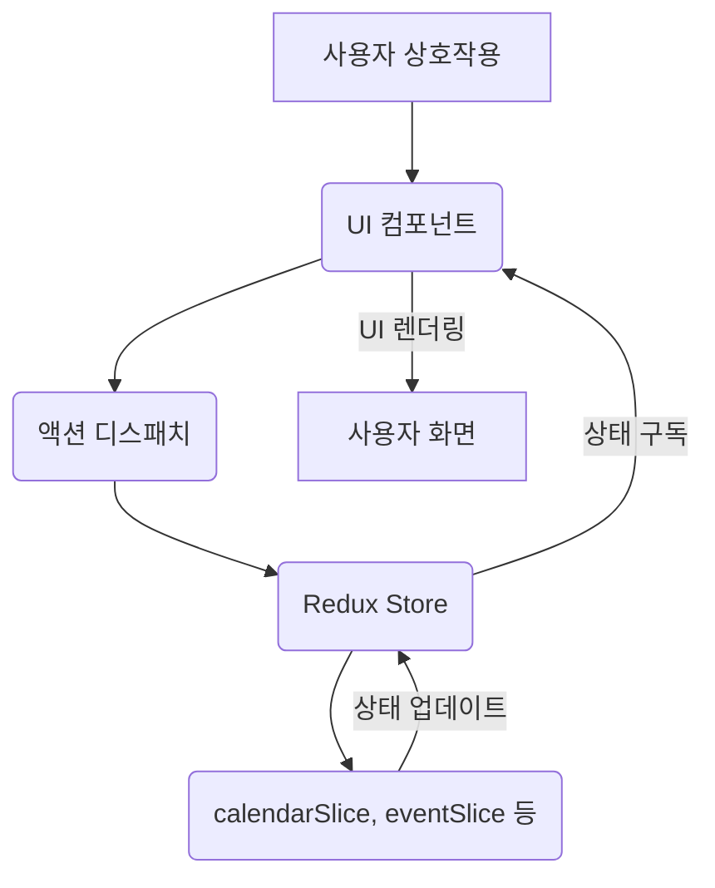

# Google Calendar Clone Project

[Google Calendar](https://calendar.google.com/calendar) 서비스 중 주간별/월간별 캘린더 뷰를 클론 개발한 프로젝트입니다.

## 1. 기본 내용

### 주요 사용 기술

- **Next.js**, **React**
- **Tailwind CSS**
- **Redux Toolkit**
- **date-fns**
- **Lucide React**
- **Yarn Berry**

### 배포 링크

https://google-calendar-swart.vercel.app

### 실행 방법

1.  **리포지토리 클론**
    ```bash
    git clone https://github.com/wayandway/google-calendar
    ```
2.  **설치**
    ```bash
    yarn install
    ```
3.  **실행**
    ```bash
    yarn dev
    # 브라우저에서 http://localhost:3000 접속 후 애플리케이션 확인 가능
    ```

## 2. 상태의 흐름 (도식화)



### 상세 설명

- **전역 상태 관리**: Redux Toolkit을 사용하여 `calendarSlice` (현재 날짜, 뷰 모드 등 캘린더 상태), `eventSlice` (이벤트 목록, 선택된 이벤트 등 이벤트 상태), `layoutSlice` (사이드바, 미니 캘린더 열림/닫힘 상태) 등의 전역 상태를 관리합니다. 이를 통해 애플리케이션 전체에서 일관된 상태를 유지하고 컴포넌트 간의 데이터 전달을 효율화합니다.
- **미니 캘린더, 메인 캘린더의 동기화**: `calendarSlice`의 `currentDate` 상태를 통해 미니 캘린더와 메인 캘린더가 항상 동일한 날짜를 바라보도록 동기화됩니다. 한 캘린더에서 날짜를 변경하면 다른 캘린더도 자동으로 업데이트됩니다.
- **모달 상태 관리**: `MainCalendar` 컴포넌트에서 `isFormModalOpen`, `isViewModalOpen` 등의 상태를 관리하여 이벤트 생성/조회 모달의 열림/닫힘을 제어합니다. 또한 `modalPosition` 상태를 통해 모달의 위치를 동적으로 결정하여 사용자 클릭 지점 근처에 모달이 표시되도록 합니다.
- **로컬스토리지 활용**: 이벤트 데이터(`eventSlice`의 `events`)는 브라우저의 로컬 스토리지에 저장됩니다. 이를 통해 사용자가 페이지를 닫았다가 다시 열어도 기존에 생성했던 이벤트들이 유지됩니다.

## 3. UX를 위해 추가한 요소들

실제 Google Calendar 프로덕트에서 제공하는 다양한 기능을 최대한 포함하려고 노력했습니다.

- **스크롤로 이전/다음 달 스크롤 이동**
  <br/> 월별 캘린더 뷰에서 마우스 휠 스크롤을 통해 이전 달 또는 다음 달로 쉽게 이동할 수 있습니다.

- **주간별 캘린더뷰 드래그앤드롭**
  <br/> 주간별 캘린더 뷰에서 드래그앤드롭을 통해 15분 단위로 자유롭게 날짜 및 시간을 지정하여 이벤트를 생성할 수 있습니다.

- **반복 일정 선택지**
  <br/> 이벤트 생성 시 반복 일정(매일, 매주, 매월, 매년, 주중 매일) 선택지를 추가했으며, 시작 날짜를 기준으로 반복 규칙을 자동으로 생성합니다.

## 4. 주요 문제 사항

- **이벤트 일정 중복 구현** : 여러 이벤트(일정)가 동시에 발생할 경우 겹치지 않게 시각적으로 표시하는 레이아웃 구현에 어려움이 있었습니다.

- **모달 UI 구현** : 실제 Google Calendar의 모달과 유사하게 디자인하고, 사용자의 클릭 위치에 따라 모달이 나타나며, 내부 요소들이 적절하게 배치되도록 하는 데 많은 스타일 조정이 필요했습니다. 특히 시간대 입력 필드의 동적 변경 및 세로 배치 구현에서 복잡성이 있었습니다.

## 5. 성능 체크

웹 페이지의 성능 및 사용자 경험 개선을 위해 **Lighthouse** 도구를 활용하여 주기적으로 성능을 측정하고 분석했습니다.

## 6. 추가 개선점

- 모달 UI 추가 개선

- 월간 캘린더 뷰에서 다중 날짜 선택 구현

- 애니메이션 추가(페이지 전환, 이벤트 생성/삭제, 모달 열림/닫힘 등)
